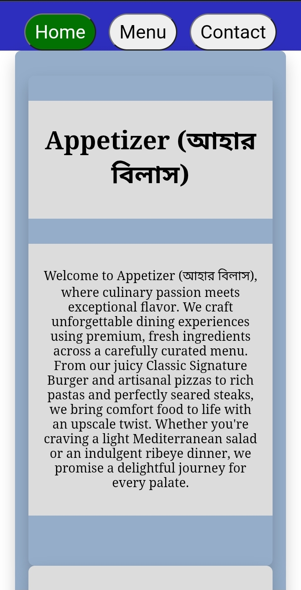
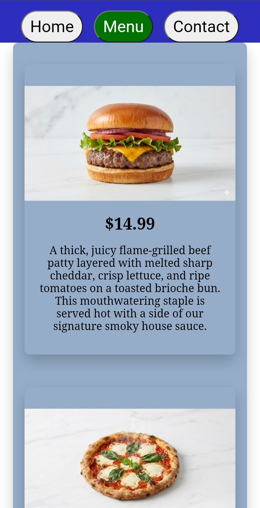
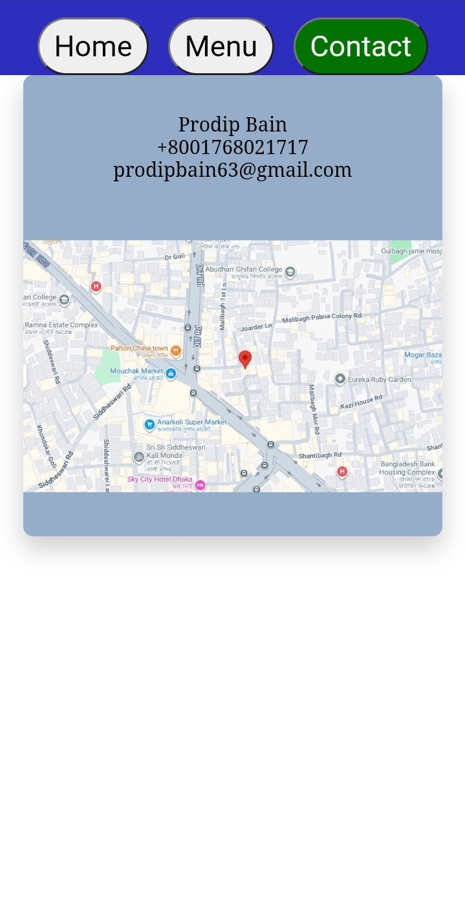

# Restaurant Page

A restaurant website built as part of **The Odin Project** JavaScript curriculum. This project focuses on learning how to use **Webpack**, ES6 modules, and DOM manipulation to build a single-page application (SPA) without writing multiple HTML pages.

---

## [Live Demo](https://pbain63.github.io/Project_Restaurant-Page/)

---

## Repository:

https://github.com/pbain63/Project_Restaurant-Page

---

## About The Project

The Restaurant Page is a fully responsive website that simulates a restaurant's landing page. It includes multiple tabs (Home, Menu, Contact) that dynamically render content without page reloads. The project focuses on organizing JavaScript code into modules and leveraging Webpack to bundle assets.

---

## Screenshots

### Mobile View

| Home Page                                     | Menu Page                                     | Contact Page                                        |
| --------------------------------------------- | --------------------------------------------- | --------------------------------------------------- |
|  |  |  |

---

## Features

- Home, Menu, and Contact sections
- Dynamic page rendering using JavaScript
- Single-page application (SPA) behavior
- Modular JavaScript using ES6 import/export
- Webpack bundling
- Image asset management with Webpack
- Deployed using GitHub Pages

---

## Built With

- HTML5
- CSS3
- JavaScript (ES6 Modules)
- Webpack
- npm
- Git
- GitHub Pages

---

## Project Structure

The repository contains two branches:

| Branch     | Description                                                                  |
| ---------- | ---------------------------------------------------------------------------- |
| `main`     | Source code with `src/` folder, Webpack configuration, and package files.    |
| `gh-pages` | Built distribution files (`index.html`, `main.js`, assets) for GitHub Pages. |

### Main Branch (`main`)

```text
├── src/                  # Source files
│   ├── index.js/         # Entry point
│   ├── modules/          # JavaScript modules for each tab
│   ├── styles/           # CSS files
│   └── assets/           # Images and other static assets
├── .gitignore
├── package.json
├── package-lock.json
├── webpack.config.js
└── README.md
```

### Gh-Pages Branch (`gh-pages`)

```
├── index.html
├── main.js               # Bundled output
└── *.png                 # Compiled images
```

---

## Getting Started

### Installation

1.  **Clone the repo**
    ```sh
    git clone https://github.com/pbain63/Project_Restaurant-Page.git
    ```
2.  **Install NPM packages**
    (This will install Webpack and other dependencies listed in `package.json`)
    ```sh
    npm install
    ```
3.  **Build the project**
    ```sh
    npx webpack
    ```
    _Or if you have a build script configured:_
    ```sh
    npm run build
    ```
4.  **Open the project**
    Open `dist/index.html` in your browser to view the site.

---

## What I Learned

Through this project I practiced:

- Configuring Webpack
- Working with ES6 modules
- Importing images and other assets
- Dynamically creating DOM elements
- Separating code into reusable modules
- Deploying a Webpack project to GitHub Pages

---

## Acknowledgements

This project was completed as part of **The Odin Project** JavaScript Course.

Assignment:
https://www.theodinproject.com/lessons/node-path-javascript-restaurant-page

---

## License

This project is open source and available under the [MIT License](LICENSE).

---
